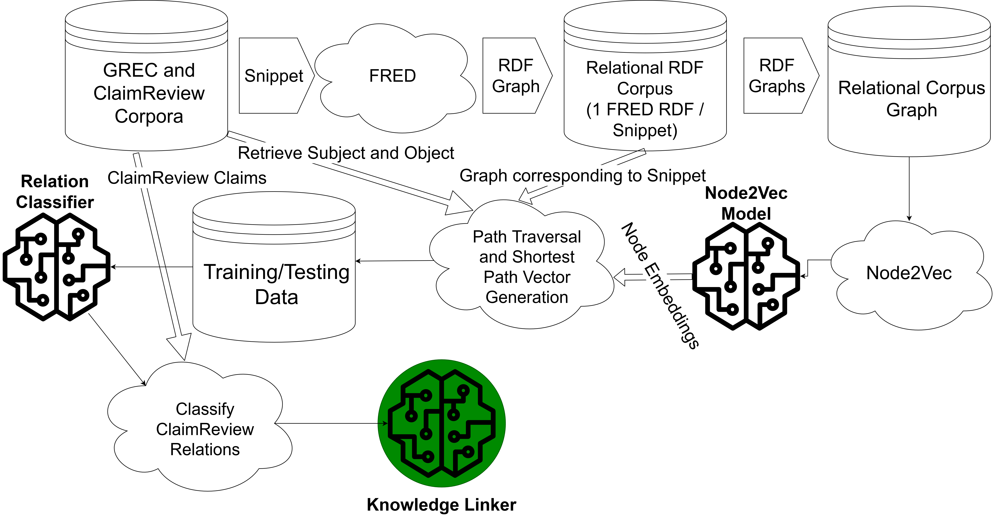

# REMOD: Relation Extraction for Modeling Online Discourse

The following are the instructions to strictly reproduce the results cited in the paper.



## Prerequisites
The necessary packages can be installed as an Anaconda environment from the `environment.yml` file.

### Dataset

First, change `DATA_PATH` in `config.py` to the directory that you would like to store your data. Then,

To download the Google Relation Extraction Corpus (GREC):

```
python get_data.py
```

To build a corpus of claims, please consult the documentation for the [Google FactCheck API](https://toolbox.google.com/factcheck/apis), and add your data to the `JSON_DIR` as a JSON in the same format as the GREC.

## Preprocessing

### FRED Parsing
To parse, first acquire a [FRED](http://wit.istc.cnr.it/stlab-tools/fred/) API key, and past it in a text file at `DATA_PATH/api_keys/fred_key_lmtd`. Then:

```
python generate_fred_rdfs.py
```

This should produce a directory of RDF files, one for each JSON file.

### Identify terminal nodes
The following script identifies the nodes that correspond to the subject and object for each snippet, and store them in a dataframe, to be used later when calculating the shortest path.

```
python identify_terminal_nodes.py 
```

### Build Corpus Graph

```
python build_corpus_graph.py
```

### Generate Node Embeddings
Be sure to note the corpus graph file tag, i.e. `corpus_graph-<tag>.pkl`

```
python generate_node_embeddings.py -tag <corpus_graph_file_tag>
```

## Relation Classification

### Build Shortest Path Vectors
To build the features for the relation classification training, run:

```
python build_shortest_path_df.py
```

#### Generate Train/Test Splits
Currently, training is not implemented with cross-validation, so this step is necessary (although it is a TODO to add cross-validation training).

```
python test_train_splits.py
```

### Train a Model on shortest path vectors for relation classification
The experimental tag needs to be provided. This is the tag attached to the split files, i.e. `X_train-<exp-tag>.pkl`

```
python train.py --model-name "dnn_wide" -itag <exp_tag>
```

### Test model on ClaimReview Claims
To test the model on the selected ClaimReview claims, run the code found in ```classify_claimreview.ipynb``` or export this code to a python script. Be sure to change the input filenames found at the top of the notebook. 

## Fact-checking

### Install Knowledge Stream
To fact-check the relevant claims from ClaimReview, first install [Knowledge Stream](https://github.com/mjsumpter/knowledgestream) and download and extract the [data](http://carl.cs.indiana.edu/data/fact-checking/data.zip) to `config.KS_DIR`.

### Prep Classified ClaimReview Claims for input to Knowledge Stream algorithms
Run the code found in `prep_claims.ipynb`, or export and run as a python script. Again, be sure to check filenames found throughout script.

### Run Knowledge Stream algorithms

If using my Knowledge Stream fork for Python3, you will be prompted upon running `kstream` for the data directory. Enter `<config.KS_DIR>/data`

#### Knowledge Stream (KS)
`kstream -m stream -d datasets/claimreview/claims.csv -o <config.KS_OUTPUT>`

#### Knowledge Linker (KL)
`kstream -m klinker -d datasets/claimreview/claims.csv -o <config.KS_OUTPUT>`

#### Relational Knowledge Linker (KL-REL)
`kstream -m relklinker -d datasets/claimreview/claims.csv -o <config.KS_OUTPUT>`

### Evaluate Knowledge Stream algorithms on ClaimReview Claims
Run the code found in `evaluate_kl.ipynb`, or export and run as a python script. Again, be sure to check filenames throughout script.
